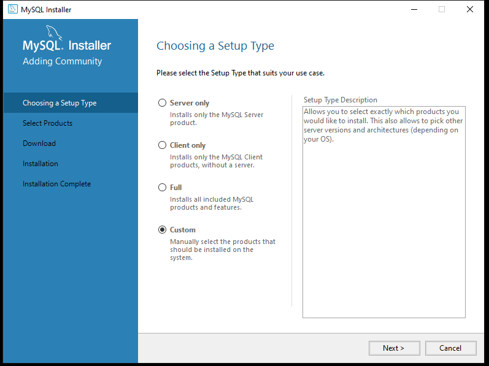
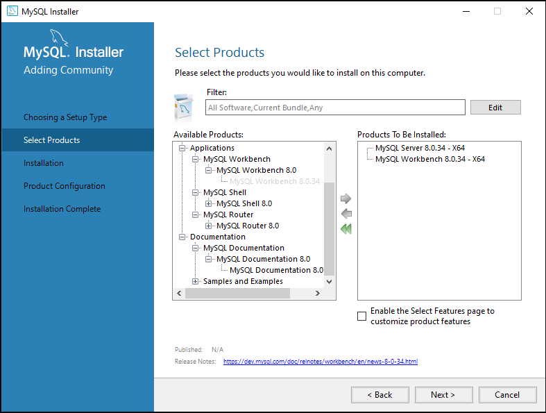
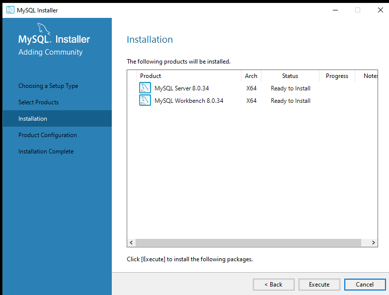
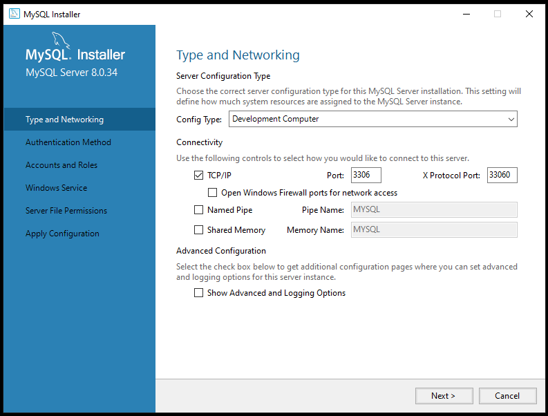
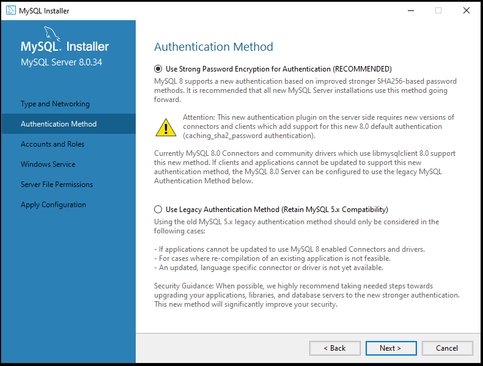
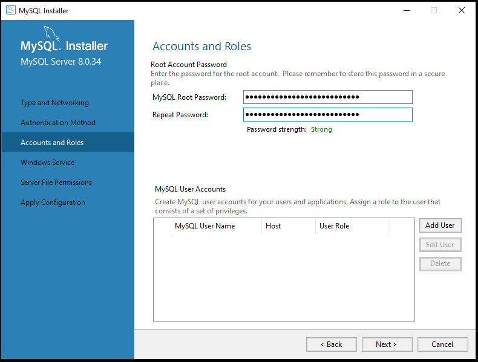
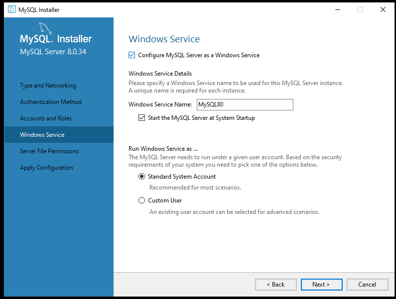
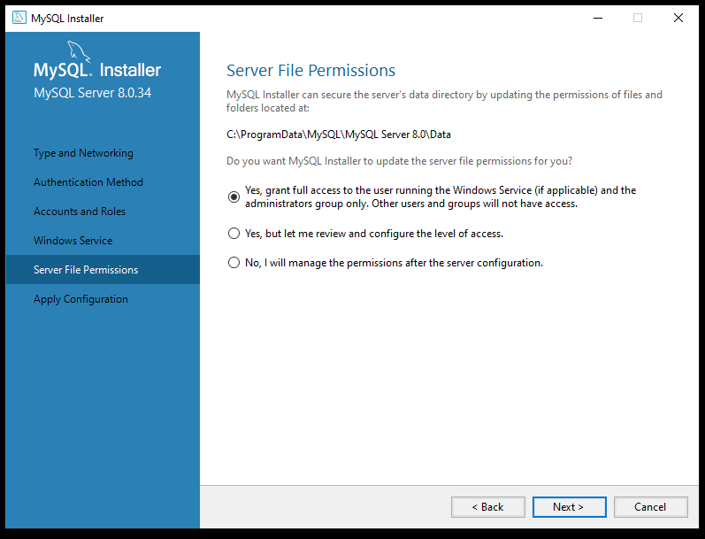
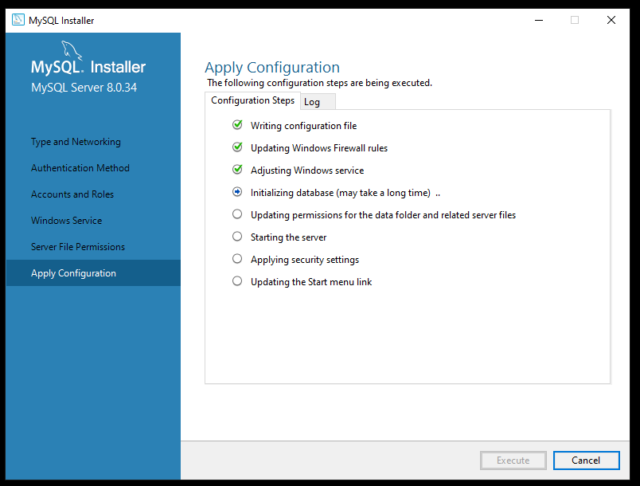

# Mysql lokaal

We gaan nu onze ontwikkelomgeving inrichten. Jullie hebben al MAMP of XAMP.
Maar deze geef nogal eens problemen en is niet geschikt voor de database design stukken van deze lessen.

Dus we gaan onze omgeving installeren zoals op een server ook gedaan zou worden.
Software voor software, en alles configureren.

## download

### MAC/linux mysql
- https://dev.mysql.com/downloads/mysql/ `community server`
- https://dev.mysql.com/downloads/workbench/ `workbench`
- https://sequel-ace.com/ `database tool`
    - als ik het in de oefeningen over `workbench` heb gebruik dan deze voor die oefening

### windows mysql
- download https://dev.mysql.com/downloads/installer/ `de installer`
- kies de grote (300+ mb)
* !!! je hoeft niet in te loggen zoek `no thanks just start my download`

## installeren

Lees wat hieronder staat eerst voordat je de installer start

* Voor windows start de installer 
* voor mac start de installer zie ook (dit kan ik zelf niet testen)
https://dev.mysql.com/doc/mysql-installation-excerpt/8.0/en/macos-installation.html
* voor linux zie
https://dev.mysql.com/doc/mysql-installation-excerpt/5.7/en/linux-installation.html

## installer starten

- start de installer
- doe nu `rustig` stap 1-10 hieronder, zodat je geen fouten maakt

## installer stappen

1) kies `custom`

2)
- click op de [+]jes voor `mysql server` & `mysql workbench` totdat je geen plusjes meer hebt
- gebruik de `groene pijl` om `mysql server` & `mysql workbench` in de `install kolom` te zetten

3) check of bij de installation stap het er zo uitziet:

4) ja? click op `execute`

## configuration

5) vink `open windows firewall` uit, wij willen niet van buiten benaderbaar zijn

6) strong is prima, volgende

7) maak een strong password aan, sla deze in je password manager op!

* gebruik je root alleen voor administratie taken zoals:
- schema/tables/stored procedures maken
- gebruikers maken
- rechten beheren van de DATABASE
* !! Dus niet in je applicatie!
- waarom niet?

8) laat alles zo staan

9) laat alles zo staan

10) klaar! druk op `execute`

## klaar!

nu ben je er klaar voor, ga naar de volgende opdracht
