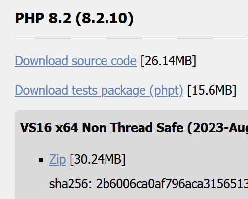
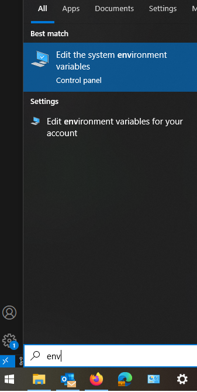
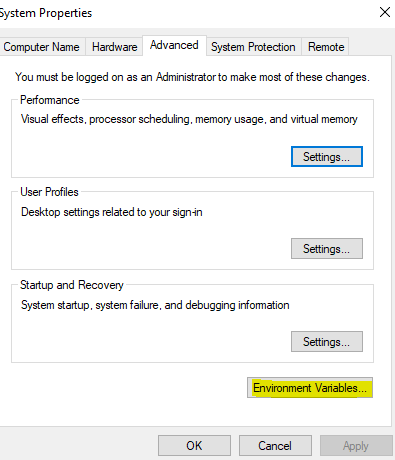
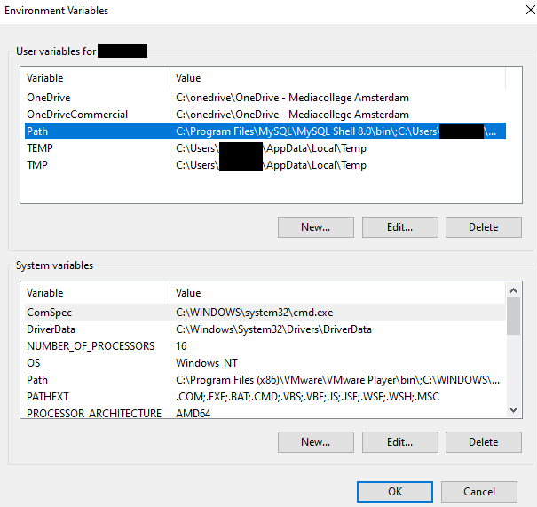

# php

we hebben php op lokaal nodig, in de commandprompt

## Download voor Windows
- ga naar https://www.php.net/downloads
- click op windows
- download `php 8.xx` (de laatste) de `VS16 x64 Thread Safe` versie, de `zip`

## Download voor linux
- op https://www.php.net/downloads download `php 8.xx` (de laatste)

## Download voor MAC 
- waarschijnlijk heb je al php, test dat (zie kopje `testen`)
- zo niet moet je even zoeken op het internet
- zoek je php ini 
- doe de configuratie stappen van de extensions wel (`zie "## configuratie file maken" hieronder`)

# WINDOWS instructies

## Uitpakken en installeren

1) Maak op je laptop een map backend programma's aan
`!!! deze mag niet in of ergens onder je one-drive folder staan!!!`
2) pak daar de `php zip` uit (zie je downloads `php 8.xx ....zip`)

## toevoegen aan je pad

je moet nu de uitgepakte php directory aan je pad toevoegen

- kopieer het volledige path naar je php directory
- druk op je windows knop, en type `Environment variables`
* je ziet dan (als het goed is) `edit the system Environment variables`
* Zie je het niet? Ga naar System in je settings, vindt `advanced settings`

- click op `Environment variables`

- click `path` open

- voeg een nieuwe regel toe
- plak daar het path naar de php directory toe, druk op enter
- click ok

## configuratie file maken

- ga naar je php directory
- kopieer `php.ini-production` en noem die `php.ini`
- open `php.ini` in vscode

!! ik werk vanuit de productie, omdat ik graag `least privilege` werk

## configuratie aanpassen van php

### debug (nooit in productie)

- zoek de regel `display_errors = Off` verander `Off` naar `On`
- zoek de regel `display_startup_errors = Off` verander `Off` naar `On`

### extensions configureren

- zoek de regel `;extension=mysqli` haal de `;` weg (dit zet mysqli aan zodat je die kan gebruiken)
- zoek de regel `;extension_dir=ext` haal de `;` weg 

## testen

open een commandline (niet in de php directory) en type
- `php -version`

krijg je wat te zien? hij doet het
