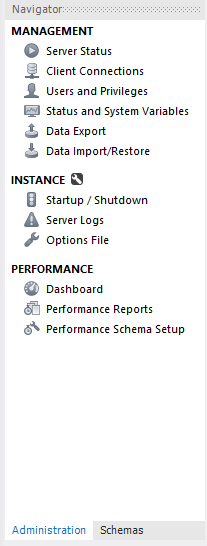
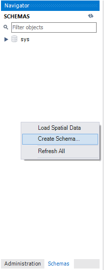
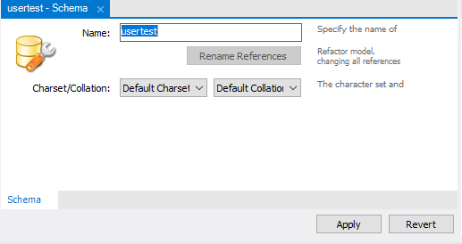
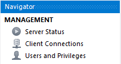
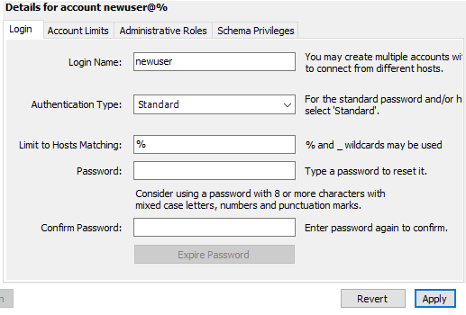
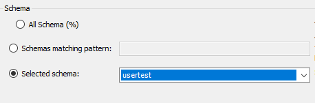

## Users

je wil `NOOIT` en ook echt `NOOIT` je `root login` gebruiken in een application
Wat is daar de oplossing voor?

gebruikers per `APP` of misschien zelfs per `Deel` van de `App`

## workbench

- start mysql workbench
- log in op je localhost met je `root`

## Navigator tabs

in mysql workbench heb je 2 tabs in de `navigator`:
- administration
- schemas

## OPZET: een schema maken

om users te kunnen oefenen hebben we een schema nodig
- ga naar de schemas tab
- `right click` in de navigator 

- click op create schema
- noem het schema `usertest`

## Administratie tab

we gaan nu naar de administration tab

hier heb je functionaliteit om de database server te beheren

## gebruiker maken

- click op `users and privileges`

- maak nu een `gebruiker` door op `Add Account` te clicken
- noem deze `usertestapp`
- maak een een `goed password`. (sla het wachtwoord op in een passwordmanager)

## admin & schema privileges

je ziet nog meer tabs:

* wij willen nu de rechten geven aan deze gebruiker op ons nieuwe schema `usertest`
* we zitten niet aan de administrative roles tab!! dat is globaal over de hele database en dus `gevaarlijk`

- click op de `schema privileges` tab
- hier staat een `Add Entry ...` knop click daarop
- in de popup selecteren we `Alleen` ons schema
* dit is omdat deze user alleen voor `1 app` is en dus geen rechten nodig heeft op de database of andere schemas. Dit is het `least privilidge` principe: alleen wat je minimaal nodig hebt niets meer

- Vink in `object rights` alleen `select`
- meer hebben we niet nodig, maar gebruikelijk voor een app is:
    - select
    - delete
    - insert
    - update
    - execute
* mogelijk dat je dus voor 1 app meerdere users hebt, afhankelijk van de rollen binnen de app bv:
* een admin rol mag insert & delete
* een lees rol mag alleen select

## inleveren

- maak een screenshot van het resultaat (`deze moet je inleveren/laten zien`)
