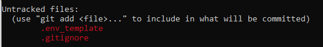
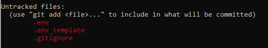

## .env file

We hebben nu onze `.env_template` en `.env` files. 

## Database login

we gaan in het werkveld en de lessen veel met databases werken

WAT we `NOOIT` willen is je login of wachtwoorden in git zetten
Je gevoelige data mag nooit in welke source control ooit.

Dus onze `.env` file waar echte login data in komt mag dus `NOOIT` in git komen.
Als dat wel gebeurt `MOET` je de data veranderen, dus user/password voor het geval dat.

maar hoe doen we dat?

## IGNORE

- VOORDAT je commit, maak je een `.gitignore` file
- in de .gitignore file zet je `.env` 
 
    > Tip het is handig om standaard .gitignore files te bewaren en het aan te leren die eerst in je project te zetten voordat je begint

## TEST

- ok voordat we gaan committen eerst testen
- ga in je commandprompt/terminal naar de directory `05 connectie`
    > dus waar `.env` en `.env_template` in staan
- type in: `git init`
    > we werken lokaal en nog niet met github!
- type in: `git add`
- type in: `git status`
- staat `.env` ertussen in je staged files?
    * NEE?: je kan verder
     *`GOED`*: 
    * JA?: repareren
     *`FOUT`*: 

## echte commit

- delete de `.git` directory die je met `git init` gemaakt had (let goed op!)
- `commit` nu naar je git repo voor dit vak (op github)
- CHECK online of alles ok is

> ### Extra info (wel lezen!)
> 
> 
> ## OPTIE 2 Environmental variables
> 
> Je kan ook je data in de `Environmental variables` van de PC/server > zetten
> wordpress in docker gebruikt dit bijvoorbeeld. En dan haal je de > waarde in PHP op
> zo kan het ook niet in je git terecht komen
> 
> 
> ## OPTIE A,B,C,D .... ETC
> 
> er zullen nog meer opties zijn:
> * bv de files buiten de web directory zetten
> * uit een webservice halen
> * encrypted in de file zetten (maar waar staat de decrypt sleutel > dan ^^?)
> * je kan services van AWS of Azure gebruiken
> 
> ## maar is het veilig?
> 
> Als iemand al op je server zit? Waarschijnlijk niet want met wat > uitzoek werk krijg je het dan wel te pakken
> - daarom backups van je servers/databases
> - daarom encrypted data/databases
> - daarom `LEAST PRIVILEGE` users, user gestolen van een frontend > app? nog steeds niet overal bij
> - daarom ook dingen zoals password rotation.
> * meer lagen is meer veiligheid
> * waar een wil is is een weg, dus early detection is een must!