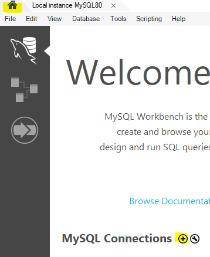
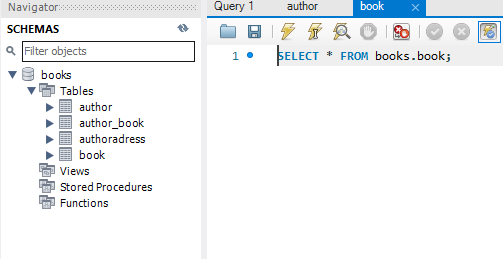

## Naar de app toewerken

We gaan zorgen dat een app op een veilige manier bij de data kan
(later gaat het nog strakker)

## User maken

Maak net als in `02 db users` een user:
- noem deze `connuser05`
- geef een goed wachtwoord *(onthouden!)*
- kies nu een van je `database schemas` die je gemaakt had met de opdrachten
- geef de user alleen `select` rechten, op het schema van jouw keuze
- click op `apply`

## user testen

maak een nieuwe connectie met mysql workbench (`huisje-> new connection`)
 

- gebruik de nieuwe user `connuser05`
- geef de connectie ook de naam `connuser05`
- open nu de nieuwe connectie en kijk of je jouw schema ziet:

 

> Je ziet bij mij ook maar 1 schema, en ik kan selecteren
> Dit doen we om de user even te testen
