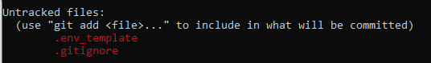
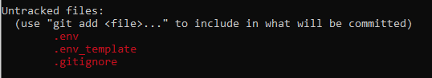

## in de .env

- open je `.env` file
- vervang de `...` in de `.env` file achter `DB_USER=...` met `connuser05`
- vervang de `...` in de `.env` file achter `DB_PASSWORD=...` met jouw wachtwoord
- vervang de `...` in de `.env` file achter `DB_HOST=...` met `localhost`
- vervang de `...` in de `.env` file achter `DB_SCHEMA_NAME=...` met de `naam` van het `schema` dat je gekozen hebt

## Check & commit

- `git status`
- staat `.env` ertussen in je staged files?
    * NEE?: je kan verder
     *`GOED`*: 
    * JA?: repareren
     *`FOUT`*: 
- commit!