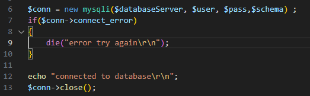
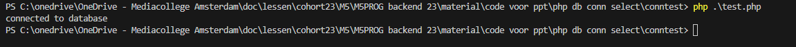

## Naar de app toewerken

we hebben onze connection data klaarstaan, nu inlezen!

## configuration lezen

De `.env` file is een configuration bestand. Daar staan instellingen in met hun waarde.

- maak een file: `dbdata.php`
- zet het volgende erin:
 

## test.php

- maak een file: `test.php`
- `include_once` de file `dbdata.php`
- zet het volgende erin:
 

## Hoe run je een PHP file?

- open een `cmd` waar je `test.php` staat
- type `php test.php`
> Nu zie je als het goed is `connected to database` staan

 

## Check & commit

- `git status`
- staat `.env` ertussen in je staged files?
    * NEE?: je kan verder
     *`GOED`*: 
    * JA?: repareren
     *`FOUT`*: 
- commit!