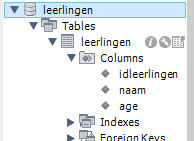
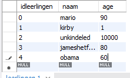

## Veiligheid

we hebben tot nu toe met queries gewerkt.
Dit is leuk oefenen, maar dit is super onveilig.
gewone queries in code? NEE
we gebruiken `prepared statments`
Maar eerst kijken waarom queries slecht zijn

## start

We hebben een database en een table nodig (maak deze direct aan op de database `geen diagram`):
- maak een schema `prepstatements`
- maak in `prepstatements` maken een table `leerlingen`.
- geef deze table de volgende colommen:
    * naam
    * leeftijd
    * klas
     
    
## data
- stop 3 `verzonnen leerlingen` in `leerlingen`, gebruik game, film of anime characters
- voeg ook `mario` en `sonic` toe
     

- maak een script van je `schema` script en sla dat op
    - TIP: gebruik hier `data export wizard` voor (`adminstration` tab)
    
## user

Deze app heeft ook een user nodig.
We gebruiken voor nu de user van `connuser05` uit oefening `05 connectie`
- geef de user `connuser05`:
    - `select` rechten op tabel `leerlingen` in schema `prepstatements`