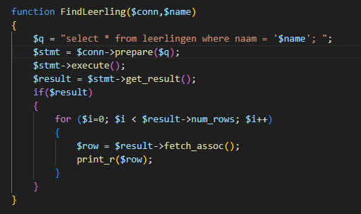
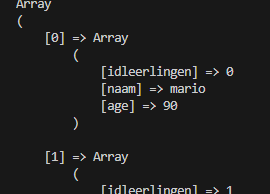
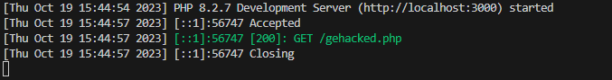
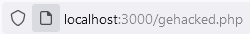
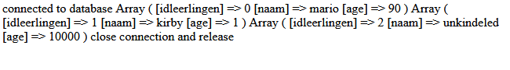
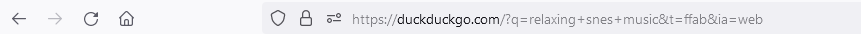
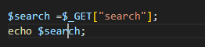
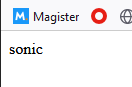
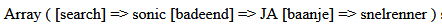

## Php

- maak een nieuwe directory `06 prepared statements`
- maak een php file `gehacked.php` in die directory
- kopieer de files `.env` en `dbdata` uit oefening `05 connectie`
- maak een database connectie in je php
    - gebruik je code uit `test.php` van  oefening `05 connectie`
- test je database connectie
    - Zie je een fout? of een connectie bericht?

    > php opstarten?
    > in de `cmd` type je `php gehacked.php` 

## Selecteren

Laten we eerst eens alle leerlingen selecteren:
- maak deze function in je `gehacked.php`
<br>

- test je `gehacked.php`
<br>


## in de browser

Nu willen we Php in de browser hebben:
- ga naar je commandline
- type `php -S localhost:3000` *(in de directory van je .php file, bv index.php)*
<br>

- in je browser kan je nu gaan `http://localhost:3000/gehacked.php`

<br>
<br>


## Query string

Kijk eens naar deze duckduckgo url:
<br>

dit is nadat ik gezocht heb.
> duckduckgo maakt van mijn zoek `relaxing snes music` een querystring:
> `https://duckduckgo.com/?q=relaxing+snes+music`
> zo geeft de browser data van javascript/html door naar de server (php of iets anders)


## zelf doen!

Als we achter de url `http://localhost:3000/gehacked.php` wat zetten:
`http://localhost:3000/gehacked.php?search=sonic`
dan hebben we een query string gemaakt achter de url, net als duckduckgo.
> Hier staat nu een variable `search` met waarde `sonic`


- open `gehacked.php`
- zet boven in het volgende erbij:
```
$search = $_GET["search"]; 
```
> hier halen we nu de waarde `sonic` uit de url en stoppen die in `$search`  
> `$_GET` is een speciale variable van `php` waar alle dingen in de query string in staan

- echo nu `$search`
<br>
- open in je browser:
    - `http://localhost:3000/gehacked.php?search=sonic`
    - `http://localhost:3000/gehacked.php?search=mario`

> dan zie je zo'n soort resultaat:
<br>

## hele query string printen

- voeg nu in je `php` het volgende toe:
 - `print_r($_GET);`
- ga in je browser naar:
    - `http://localhost:3000/gehacked.php?search=sonic&badeend=JA&baanje=snelrenner`
> dan krijg je dit te zien in je browser:
<br>